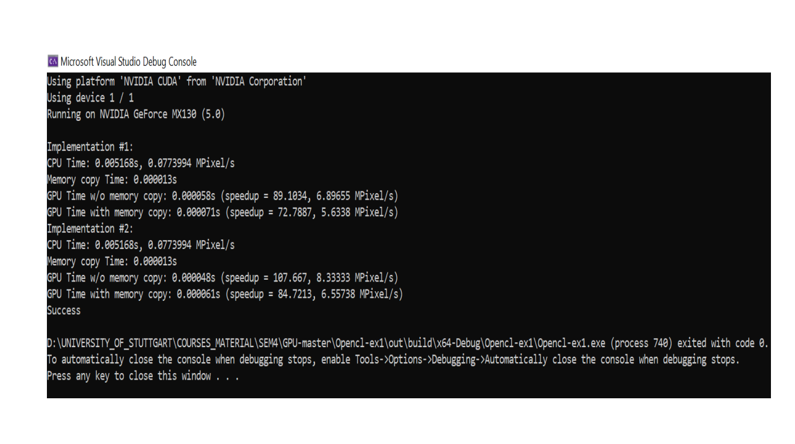

# GPU Programming 

Morphological operations like Erosion, Dilation, Opening and Closing are performed on the input image. 
This project also takes a deeper insight into the Gaussian filter and operation on
images. Finally, all of these operations being performed on a CPU and also on the GPU, where
we expect GPU process to be faster with equivalent output of the morphed images. 

The following output compares the speed of CPU and GPU for above mentioned operations.

